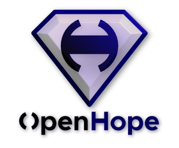

  

### [Discord](https://discord.gg/W8RZFB3BgR) | [openhope.net](http://openhope.net)* | [martin@openhope.net](mailto:martin@openhope.net)

\* redirects to this repo until ready

---

### _"The dirty secret of open source is that much of it is powered by maintainer guilt."_

\- [Feross Aboukhadijeh](https://feross.org/funding-experiment-recap/)

---

**OpenHope** is a platform for open-source developers and their project users. It helps OS projects thrive and to make everyone satisfied.

---

  

# How OpenHope works

- Each member has a public profile on the platform.

- Each member has access to all materials created by other members. The material is project documentation, tutorials, articles, etc.

- Each member has to divide the half of the received credits or at least a minimal amount of credits (if the income is too low) among other members each month. Undivided credits will be used for the platform infrastructure costs and development. The remaining credits may be exchanged for money.

- Each member can buy credits (aka _Hopes_) by real money.

- Each member can follow other members or projects to receive news or general messages.

- Everybody can search for members, projects or organizations. And filter the results by multiple conditions.

_Note:_ The project is in the design phase. All features and principles are open to discussion on [Discord](https://discord.gg/W8RZFB3BgR).

---

  

# What problems OpenHope solves

> "What most OSS developers want is for their work to be used and appreciated. Acknowledgment, attribution, and contribution are the major currencies of open source."
>
> \- From the article [The New Rules for Playing in Microsoft's Open Source Sandbox](https://aaronstannard.com/new-rules-dotnet-oss/)

Creators and project authors are intrinsically motivated and driven by passion for creating things and by gaining the reputation. 

They are willing to create for free. However, this often leads to burnout, poor or non-existent documentation and even abandonment of the successful project.

> "Do you work full time on the project?" "I have done for a year or two, but recently I ran out of money and had to find employment."
>
> \- Louis Pilfold on the [Elm forum](https://discourse.elm-lang.org/t/v0-13-of-gleam-a-type-safe-back-end-language-that-runs-on-the-erlang-vm-is-out/6750/4)

So we have to provide an extrinsic (financial) motivation to allow project authors live a normal live without worrying about paying their rent while they maintain the projects. Or we need to motivate other people to jump in and maintain the projects instead of the original authors.

> "This site is awesome. I use it all the time, and I need a way to pay you back."
>
> \- Alex Younger in the issue for the project [Tailblocks](https://github.com/mertJF/tailblocks/issues/57)

Skillful creators and maintainers should not be forced to choose between working for one company on a closed-source code for money or teaching and working on useful projects for everyone for free.

We need these people to make our technology infrastructure secure and stable.

> "..., he had “always assumed, (as had the rest of the world) that the OpenSSL team was large, active, and well resourced.” In reality, OpenSSL wasn’t even able to support one person’s work."
>
> \- From the book [Roads and Bridges: The Unseen Labor Behind Our Digital Infrastructure](https://www.fordfoundation.org/work/learning/research-reports/roads-and-bridges-the-unseen-labor-behind-our-digital-infrastructure/)

---

  

# How OpenHope solves the problems

> "Like any community of volunteers, burnout is common among open source contributors, who find themselves fielding requests, from both individual users and companies, for work without compensation."
>
> \- From the book [Roads and Bridges: The Unseen Labor Behind Our Digital Infrastructure](https://www.fordfoundation.org/work/learning/research-reports/roads-and-bridges-the-unseen-labor-behind-our-digital-infrastructure/)

There are certain tasks the maintainers have to do to support project users. They are annoying for most developers and they often slow down the development. The higher amount of these tasks leads to the burnout. Examples: 

- Writing documentation.
- Creating a personal or project website / profile.
- News announcement.
- Marketing for the creator or project.
- Writing articles, tutorials and examples.
- Answer the user questions, fix bugs, implement requested features, write migration guides, etc.

OpenHope should help with those tasks as much as possible and especially reward maintainers for doing them.

> "Sustainable open source projects are ones that spawn sustainable businesses."
>
> \- From the article [How to Build Sustainable Open Source Software Projects](https://aaronstannard.com/sustainable-open-source-software/).

The paywall should motivate companies and other consumers to pay for open-source project development.

> "Reliable, error-free transitive dependencies are invisible. Therefore, the maintainers are invisible, too."
>
> \- From the article [Recap of the \`funding\` experiment](https://feross.org/funding-experiment-recap/)

The requirement to give the half of the income to other users should motivate maintainers of the highly visible projects to support also the authors of their dependencies and needed tools.

---

  

# FAQ

1. _"All open-source code and related things should be free!"_
   - Until everybody has _Universal basic income_, creators cannot work on public projects for free.

1. _"Why paywall and not multi-licensing / donations / marketplace / ads / paid support / bounties / ...?"_
   - I like simple things. I don't like ads. Donations don't work well enough. The marketplace is almost impossible to make universal, etc.

1. _"What technology do you want to use for writing OpenHope?"_
   - I would like to write it in Rust with [MoonZoon](http://moonzoon.rs/). Another option would be something like [Seed](https://seed-rs.org/) and [Actix](https://actix.rs/).

1. _"What is the next step?"_
   - I would like to to write detailed OpenHope specifications based on the community feedback.

1. _"Could I help somehow? / Where can I find more information?_"
    - Join our [Discord chat](https://discord.gg/W8RZFB3BgR) and don't hesitate to ask any questions or present your ideas.
    - Create a pull-request if you want to fix typos, dead links, weird Czech-English sentences, etc.
    - Don't hesitate to tell your friends about OpenHope and feel free to share the link ([http://openhope.net](http://openhope.net)) on social platforms / forums / blogs / newsletters. 

---

  

# Related articles, videos and books

- "Recap of the \`funding\` experiment" [[article](https://feross.org/funding-experiment-recap/)]
- "The Few, the Tired, the Open Source Coders" [[article](https://www.wired.com/story/open-source-coders-few-tired/)]
- "Food on the table while giving away code" [[article](https://daniel.haxx.se/blog/2021/01/15/food-on-the-table-while-giving-away-code/)]
- "How to Build Sustainable Open Source Software Projects" [[article](https://aaronstannard.com/sustainable-open-source-software/)]
- "The New Rules for Playing in Microsoft's Open Source Sandbox" [[article](https://aaronstannard.com/new-rules-dotnet-oss/)]
- "Let’s talk about open source sustainability" [[article](https://github.blog/2019-01-17-lets-talk-about-open-source-sustainability/)]
- Basically everything from [Nadia Eghbal](https://nadiaeghbal.com/oss/), e.g.:
   - "Roads and Bridges: The Unseen Labor Behind Our Digital Infrastructure" [[free ebook](https://www.fordfoundation.org/work/learning/research-reports/roads-and-bridges-the-unseen-labor-behind-our-digital-infrastructure/)]
   - "The Making and Maintenance of our Open Source Infrastructure" [[video](https://www.youtube.com/watch?v=5wLKnN3To-k)]
   - "Open Source Survey" [[article](https://opensourcesurvey.org/2017/)]
   - "Rebuilding the cathedral" [[slides](https://www.slideshare.net/NadiaEghbal/rebuilding-the-cathedral), [video](https://www.youtube.com/watch?v=VS6IpvTWwkQ)]
   - "Working in Public: The Making and Maintenance of Open Source Software" [[book](https://www.amazon.com/dp/0578675862/)]

---

  

# Authors

- Awesome community 
  - Thanks [@thedodd](https://github.com/thedodd), [@arn-the-long-beard](https://github.com/arn-the-long-beard), [@pythoneer](https://github.com/pythoneer), [@strowk](https://github.com/strowk), [@TomciikL](https://github.com/TomciikL) and others for the first round of feedback for the idea!
- Martin Kavík 
  - [Seed](https://seed-rs.org/) maintainer, [Rust](https://www.rust-lang.org/) freelance developer
  - OpenHope and [MoonZoon](http://moonzoon.rs/) founder
  - [martin@openhope.net](mailto:martin@openhope.net) ; [OpenHope Discord](https://discord.gg/W8RZFB3BgR)

---

  

# Photos

1. [Micro X-ray of two flowers](https://unsplash.com/photos/1MwH5EGo26Q) by Mathew Schwartz
1. [Burn your problems](https://unsplash.com/photos/D1QI9bx8KUM) by Sebastiaan Stam
1. [Water lightbulb](https://unsplash.com/photos/N7FtpkC_P7o) by Sharon Pittaway
1. [42](https://unsplash.com/photos/fbKMKNVJjwo) by Mark König
1. [Vintage typewriter](https://unsplash.com/photos/mk7D-4UCfmg) by Florian Klauer
1. [Boat](https://unsplash.com/photos/Dph00R2SwFo) by Matteo Vistocco
1. [Analog photo film reel](https://unsplash.com/photos/g4tW1MHcy3o) by Markus Spiske
