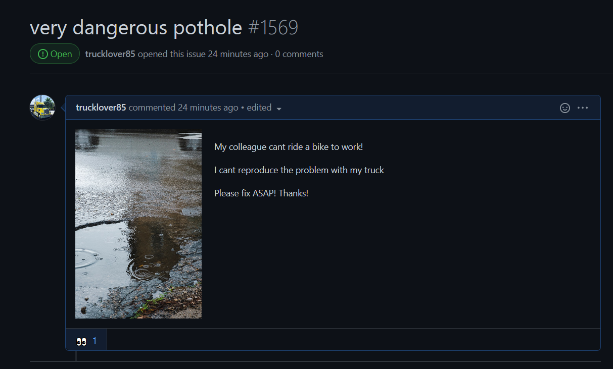
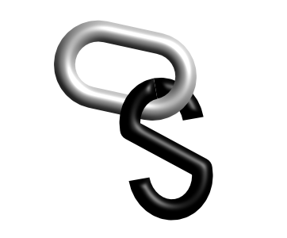

# Open-Source Roads

You wake up. Drink your morning coffee. Get in the car to drive to work. But then you realize you hit many potholes on the last trip. And you think: "Today is an ideal day for catching bronze in the sun and breath liquid asphalt!". You run to to the nearest store instead of going to work. To buy a pickaxe and rent an asphalt paving machine.

Your family and friends think you are going crazy.

You are damn good in fixing potholes after some weeks of failing and learning. You are proud of yourself when you are driving to your old work on the fixed road (you still need a day job to afford to buy new asphalt and tools).

> "Most people just weren't born for asphalt paving, no matter how hard they try."

Sometimes, wild passersby appear. They grab shovels and help a bit. You need to teach them and often check and fix their work but it's a nice change and you are mostly glad for the help. However, most people just weren't born for asphalt paving, no matter how hard they try. Or they have a very different opinion about paving.

Your road is the best in the city. Everyone loves you. The world is beautiful. A couple of drivers even toss a coin to you! It doesn't help you to buy an excavator but a scoop of ice cream is very welcome after ten-hour shift in the heating sun.

However the most of interactions with the drivers represents shouting requests from the passing vehicles. An example: "I saw a pothole several kilometers back. My company has to pay too much money for new tires! Can you fix it?". And then the same driver on the way home: "Ping @road_worker. What's the progress?".

Does it sound absurd? Welcome to the world of open-source!

  

**How can we ensure quality roads and not create voluntary slavery during the process?**

Paid maps. Drivers would be able to use roads without changes, but they would pay road workers for access to maps. Then, the workers would be able to provide better services and they would be much happier and motivated.

The result: Navigation systems would be better and road would be safer and maintained. It means less overall expenses for drivers and companies because they would pay less for car maintenance and operation.

**How would it work in practice?**

The driver would pay at least a minimum map access fee. Then he would divide the paid fee among chosen road workers. 

**Where would be maps stored? Who would provide map management tools?**

A new map platform. Drivers and workers would be able to use a part of their access fee to support the platform development and expenses.

**What about side roads that only a couple of people use?**

> "There are no main roads without side roads, no rivers without brooks and no projects without dependencies."

The most of money would probably receive the maintainers of the main roads - just because they are the most used and visible. However there are no main roads without side roads, no rivers without brooks and no projects without dependencies. That's why the maintainers would have to divide the half of their income among other workers. 

  

**How does that all relate to the open-source development?**

Imagine maps replaced by project documentation and tutorials. Imagine a library, tool or framework maintainer instead of the road worker. Imagine company employees instead of drivers. Imagine a new platform. [OpenHope](http://openhope.net).

---

Images
 - [Truck](https://unsplash.com/photos/aAPCWefn97A) by Milovan Vudrag
 - [Pothole](https://unsplash.com/photos/-OOiAy2lBZc) by Matt Hoffman
